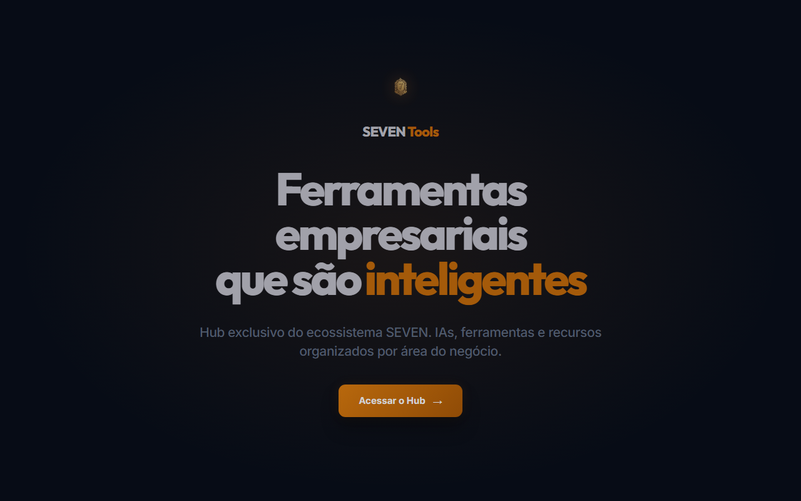
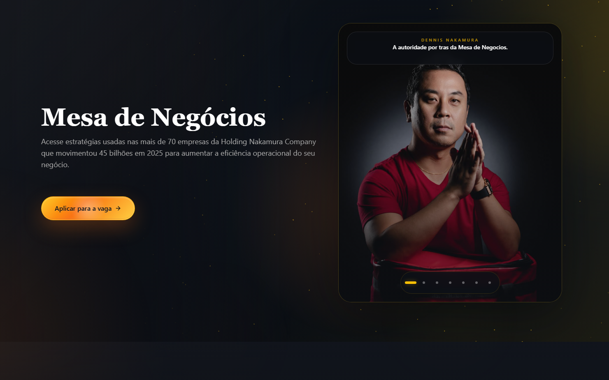

# 💼 Portfólio — Guilherme Serafim

Apresenta meus principais projetos, experiências e formas de contato.

🔗 **Acesse em:** [https://portifolio-guiler.vercel.app/](https://portifolio-guiler.vercel.app/)

---

### 🛠️ Tecnologias
React • Vite • Tailwind CSS • Shadcn/UI

---

### 🚀 Projetos em Destaque

#### SEVEN Tools — Hub de Ferramentas Empresariais
Hub exclusivo do ecossistema SEVEN para centralizar IAs, ferramentas e recursos organizados por área de negócio. O projeto combina uma SPA React no frontend com uma API FastAPI no backend, estruturando uma base escalável para entregar utilidades empresariais com experiência fluida e deploy moderno.

- **Deploy:** [seven-tools.vercel.app](https://seven-tools.vercel.app/)
- **Frontend:** [seven-tools-front](https://github.com/GuilhermeSerafim/seven-tools-front)
- **Backend:** [seven-tools-back](https://github.com/GuilhermeSerafim/seven-tools-back)
- **Stack:** React, TypeScript, Vite, Bun, FastAPI, Python, Docker, PostgreSQL, Alembic

#### Mesa de Negócios — Landing Page de Conversão
Landing page da metodologia Mesa de Negócios do Grupo SEVEN / Grupo Nakamura, criada para comunicar autoridade, gerar intenção comercial e conduzir visitantes para aplicação. A implementação usa React, TypeScript, Tailwind CSS e shadcn/ui, com fluxo de CI/CD e deploy contínuo via Vercel.

- **Deploy:** [dennisnakamura.com](https://dennisnakamura.com/)
- **Repositório:** [LP-mesadenegocios](https://github.com/GuilhermeSerafim/LP-mesadenegocios)
- **Stack:** React, TypeScript, Vite 6, Tailwind CSS, Shadcn/UI, Vercel, GitHub Actions
